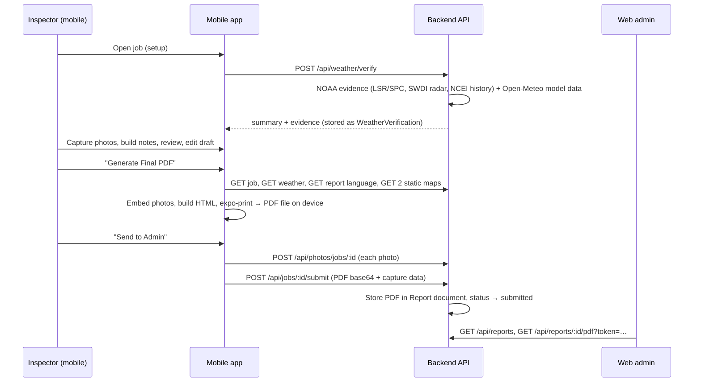

# Evidence Package PDF — Generation Flow

> **Living document.** It describes how the Evidence Package PDF is produced today, end to end
> (mobile app → backend → web admin). Every change to the PDF pipeline should update the relevant
> section **and** add a row to the [Changelog](#9-changelog).
>
> Baseline written: **2026-10-06**, from the code at mobile `85f8012`, plus the backend and web
> repositories at the same date.

**Contents**

1. [Overview](#1-overview)
2. [Where the code lives](#2-where-the-code-lives)
3. [Step-by-step flow](#3-step-by-step-flow)
4. [What the PDF contains (section by section)](#4-what-the-pdf-contains-section-by-section)
5. [Weather data today](#5-weather-data-today)
6. [Storage and admin review](#6-storage-and-admin-review)
7. [Known gaps and issues](#7-known-gaps-and-issues)
8. [Planned: NOAA weather integration](#8-planned-noaa-weather-integration)
9. [Changelog](#9-changelog)
10. [How to update this document](#10-how-to-update-this-document)

---

## 1. Overview

The PDF is generated **on the inspector's phone**. The mobile app builds one HTML document from
the local inspection draft, then converts it to PDF with `expo-print`. The backend supplies three
inputs (weather summary, report language, map images) and stores the finished PDF when the
inspector submits. The web admin downloads that stored PDF for review.

---

## 2. Where the code lives

### Mobile app (`inspection-claim-mobile-app`)

| File | Responsibility |
|---|---|
| [`utils/create-inspection-pdf.ts`](../utils/create-inspection-pdf.ts) | Builds the HTML, embeds photos, calls `expo-print`, and provides view/share/download |
| [`utils/weather-evidence-html.ts`](../utils/weather-evidence-html.ts) | "Verified Weather Data" and "Weather History" pages from NOAA evidence (pure string rendering; can be previewed outside the app) |
| [`utils/pdf-html.ts`](../utils/pdf-html.ts) | Shared HTML helpers (`escapeHtml`, `infoRow`) and the report stylesheet (`REPORT_CSS`) |
| [`lib/report-templates.ts`](../lib/report-templates.ts) | Narrative blocks (findings, process, definitions, existing conditions, codes, disclaimer, declaration) with admin overrides and built-in defaults |
| [`app/report.tsx`](../app/report.tsx) | "Final Evidence Package" screen: gathers inputs, generates the PDF, sends to admin |
| [`app/report-draft.tsx`](../app/report-draft.tsx) | "Editable PDF Draft" screen: homeowner, inspector name, claim/policy numbers, roof age |
| [`app/review.tsx`](../app/review.tsx) | Review and quality check before generating |
| [`app/setup.tsx`](../app/setup.tsx) | Job setup, including weather verification and default inspector name |
| [`hooks/use-open-job.ts`](../hooks/use-open-job.ts) | Seeds the draft from the server job (customer, address, claim) |
| [`context/inspection-context.tsx`](../context/inspection-context.tsx), [`lib/draft-storage.ts`](../lib/draft-storage.ts) | In-memory draft plus per-job autosave to device storage |
| [`lib/inspection-types.ts`](../lib/inspection-types.ts) | `InspectionData`, the shape of everything the PDF reads |
| [`lib/capture-steps.ts`](../lib/capture-steps.ts) | Capture steps, evidence sections, section order, photo-to-section routing |
| [`lib/api.ts`](../lib/api.ts) | API calls: weather, report language, static maps, photo upload, `sendEvidenceToAdmin` |
| [`lib/last-pdf.ts`](../lib/last-pdf.ts) | Remembers the last generated PDF per job (used if regeneration fails) |

### Backend (`inspection-claim-backend`)

| File | Responsibility |
|---|---|
| `services/weather.service.js` | Weather verification API: runs NOAA evidence + Open-Meteo, maps evidence level → match status and summary text, `WeatherVerification` records |
| `services/weather-evidence.service.js` | NOAA evidence orchestrator: queries sources, applies the decision ladder, builds the evidence snapshot |
| `services/noaa/*.js` | One module per source: `lsr.provider` (NWS LSR via IEM), `spc.provider` (SPC fallback), `swdi.provider` (radar hail), `storm-events` (NCEI ingest + history query), `geo`, `http` |
| `scripts/ingest-storm-events.js` | `npm run ingest:storm-events`: loads NCEI Storm Events years into `storm_events` |
| `docs/weather-evidence.md` | Backend reference for sources, decision ladder, config and ingestion |
| `services/static-map.service.js` | Static map images: Google → Mapbox → free Esri fallback |
| `services/template.service.js` | Report language package (`GET /api/templates/report-language`) |
| `services/report.service.js` | `submitInspectorEvidencePackage` (stores the mobile PDF), PDF download, review transitions, and a separate server-side `generateReport` (see [§6.3](#63-second-pdf-generator-on-the-backend)) |
| `models/Weather/WeatherVerification.js` | Stored weather lookups per job |
| `models/Weather/StormEvent.js` | Storm events with optional polygon geometry. Holds ingested NCEI Storm Events (`provider: 'ncei_storm_events'`) for history queries |

### Web admin (`inspection-insurance-web-app`)

| File | Responsibility |
|---|---|
| `modules/reports/components/reports-page.tsx` | Lists submitted reports; review, approve, reject, request changes; downloads the PDF |
| `modules/reports/services/company-report.service.ts` | Report API client |

---

## 3. Step-by-step flow

### 3.1 Open a job and seed the draft

1. The inspector opens a job. `useOpenJob` fetches it and calls `resetForJob` with customer,
   address, claim number, policy number, phone and email.
   - **Note:** `phone` and `email` are the **customer's** contact details
     ([`use-open-job.ts`](../hooks/use-open-job.ts), `job.customer?.phone/email`).
2. The draft (`InspectionData`) lives in `InspectionProvider` and is autosaved per job to device
   storage about 400 ms after each change, so it survives app restarts.
3. In setup, `inspectorName` defaults to the signed-in user's first and last name if empty.

### 3.2 Weather verification (during setup)

1. Setup calls `POST /api/weather/verify` (or `GET /api/weather/jobs/:jobId` for a cached result;
   records made before NOAA evidence are refreshed automatically).
2. The backend searches the date of loss ± `WEATHER_WINDOW_DAYS` (default 1 day) around the
   property coordinates. It queries the NOAA sources in parallel, plus Open-Meteo as supporting
   model data. See [§5](#5-weather-data-today).
3. It applies the evidence decision ladder (observed → radar-estimated → model-indicated).
4. The result is stored as a `WeatherVerification` record and returned as `summary` and
   `evidence`. The app keeps them in `data.weatherSummary` and `data.weatherEvidence`.

### 3.3 Capture, review, draft

1. The 10 capture steps produce `PhotoItem`s with step, labels, tags, notes, annotations and an
   `includeInReport` flag.
2. **Review** shows gaps and the weather status.
3. **Report draft** lets the inspector edit homeowner name, inspector name, claim number, policy
   number and estimated roof age.

### 3.4 Generate the final PDF (`app/report.tsx`)

When the screen opens:

1. **Refresh from server** (if online): reloads the job (claim number, policy number, date of loss,
   status) and the weather verification (summary and evidence), falling back to a new verify call.
   Merges both into the draft. If offline, it continues with the local draft.
2. **Report language:** `GET /api/templates/report-language`. Returns the company's admin-edited
   text and selected code citations. Failure means built-in defaults are used.
3. **Maps:** if the job has coordinates, it fetches two static images (roadmap and satellite) from
   `GET /api/maps/static`. Failure means no maps.
4. **`createInspectionPdf(snapshot, language, maps)`**:
   1. Takes photos with `includeInReport !== false`.
   2. Embeds **at most the first 80** of them. Each is resized to 720 px wide (1,200 px if
      annotated), JPEG-compressed, and base64-embedded, with a 10 s timeout. Failed photos are
      skipped.
   3. Builds the HTML (`buildReportHtml`; sections in [§4](#4-what-the-pdf-contains-section-by-section)).
   4. Calls `expo-print` with a **45 s timeout**.
   5. **If that fails, it retries with no photos at all** (20 s timeout), with no warning to the
      user.
   6. Copies the file to the app's document directory as `ClaimCapture_<Owner>_<timestamp>.pdf`.
5. `saveLastPdf(jobId, uri)` remembers it. If any step throws, the screen falls back to the last
   PDF for the job, or shows "Could not generate the Evidence Package PDF".

The inspector can then **View** (Android intent, share sheet, or iOS print preview), **Download**
(Android folder picker), or **Share** the PDF.

### 3.5 Send to admin (`sendEvidenceToAdmin` in `lib/api.ts`)

1. Uploads every included photo to `POST /api/photos/jobs/:jobId`. Uploads run 4 at a time, each
   resized before upload, and are idempotent via `clientUuid`. The first failure stops the run.
2. Reads the PDF as base64.
3. Calls `POST /api/jobs/:jobId/submit` with:
   - `pdfBase64` and `pdfFileName`.
   - `capture`: homeowner, address, completed steps, build notes, weather summary, claim/policy
     numbers, date of loss, `reportNarrative`.
   - `summary.overallNotes`: `reportNarrative` plus selected build-note texts.
   - `narrative`: a short text block (customer, property, weather line, narrative, build notes).
4. The backend stores the PDF and moves the report to **submitted** ([§6](#6-storage-and-admin-review)).

---

## 4. What the PDF contains (section by section)

Order matches `buildReportHtml` in [`create-inspection-pdf.ts`](../utils/create-inspection-pdf.ts).
"Admin text" means the company's report language package, with a built-in default when empty.

| # | Section | Content and data source |
|---|---|---|
| 1 | **Property Damage Assessment Summary** (title) | — |
| 2 | **Assigned Inspector** | Inspector: `inspectorName`. Email, Phone: `data.email`, `data.phone`, **which are the customer's** (see [§7](#7-known-gaps-and-issues)). No company name |
| 3 | **Property Information** | Address, Owner/Contact, Date of Inspection (`data.date`), Date of Loss (first 10 characters of the ISO string), Policy #, Claim #, Estimated Roof Age |
| 4 | Cover photo | Photo marked as cover, else the "Front" elevation photo, else the first photo |
| 5 | **Summary of Findings** | Admin text `summaryOfFindings` |
| 6 | **Investigation Process** | Admin text `investigationProcess` (default: 6-item method list) |
| 7 | **Damage Definitions and Assessment Criteria** | Admin text `damageDefinitions` (default: short physical/functional/cosmetic definition) |
| 8a | **Verified Weather Data** (from `weatherEvidence`) | Evidence banner (level + headline). Report information: weather report ID, address, coordinates, date of loss, search window and radius, retrieval time. **Hail Swath Map**: satellite + roads + labels base map (Esri, from `/api/maps/swath-base`) with NOAA MRMS MESH swath polygons (purple bands ≥ 0.5", 0.75", 1", 1.5", 2", 2.5"), red search-radius circle, property pin, hail/wind/tornado report markers, legend and note. **Event Verification**: up to 10 nearest observed reports (time UTC, type, size/speed, distance and direction, reporter and measured/estimated, location). **Hail Size**: largest reported vs largest radar-estimated, MRMS estimated hail at the property and largest within the radius, nearest hail evidence, strongest reported wind. **Radar-Estimated Hail (NEXRAD)**: up to 8 largest signatures with probability and radar |
| 8b | **Weather History** (from `weatherEvidence`) | NCEI official history: hail, wind and tornado day counts within the history radius, events table (date, type, magnitude, duration, distance), data coverage date. Supporting model data (Open-Meteo, labelled context-only). **Property Location** maps. **Data Sources and Methodology** (each source, its status and evidence-type definitions) |
| 8 (legacy) | **Verified Weather Data** (drafts without evidence) | Summary rows from `weatherSummary` plus a note that the values are model-based and not verified; "Property Location" maps |
| 9 | **Photographic Evidence and Supporting Documentation** | Fixed intro paragraph plus "Index of Documented Findings" (per section: damage tags and components, up to 8) |
| 10 | Photo sections | One page block per evidence section in `EVIDENCE_SECTION_ORDER`: Elevations, Collateral Damage, Spatter, Hail Impacts – Metal, Hail Impacts – Shingles, Hail Bruising, Test Squares, Wear and Tear, Roof Tie-Ins, Overview. Each photo has a caption built from label, component, elevation, direction, shot type, tags and notes |
| 11 | **Build Notes** | Build-note fields, texts, tie-ins and build-note photos (omitted if empty) |
| 12 | **Existing Conditions** | Admin text `existingConditions` with `[ROOF AGE]` replaced, or default text |
| 13 | **Codes and Standards** | Company-selected citations (state, code, title, body, source), or a one-paragraph default |
| 14 | **Disclaimer** | Admin `legalFooter` (omitted if empty) |
| 15 | **Inspector's Declaration** | Fixed text including **"The undersigned inspector is HAAG Certified"**, plus inspector name |
| 16 | Footer | "ClaimCapture Evidence Package · … · owner · address" (once, at the end; no per-page header, footer or page numbers) |

**Not in the PDF today:** the report narrative (`reportNarrative`), company name or branding,
inspector certifications or license, page numbers, and a wind swath (NOAA has no wind swath grid; wind reports are shown as markers).

---

## 5. Weather data today

Backend details: `inspection-claim-backend/docs/weather-evidence.md`.

### 5.1 Sources

| Source | Evidence type | Used for |
|---|---|---|
| **NWS Local Storm Reports** (via Iowa Environmental Mesonet) | Observed | Event verification: hail size, wind speed, tornado, reporter, measured/estimated |
| **SPC storm reports** | Observed | Fallback only, when the IEM feed is unreachable |
| **NCEI SWDI `nx3hail`** | Radar-estimated | NEXRAD hail signatures near the property: estimated maximum size and probability |
| **NOAA MRMS MESH** (`MESH_Max_1440min`, AWS `noaa-mrms-pds`) | Radar-estimated | Hail swath polygons for the map (~1 km grid, 24 h max per UTC day), estimated hail at the property and max within radius. Counts as radar evidence at ≥ 0.5" |
| **NCEI Storm Events Database** | Official record | History counts and table (with duration). Ingested monthly into `storm_events`; about 2–3 months behind |
| **Open-Meteo** | Model-indicated | Supporting context (wind, rain, thunderstorm codes). **Never** verifies an event |

### 5.2 Decision ladder (evidence level)

Search: date of loss ± `WEATHER_WINDOW_DAYS` (default 1), within `WEATHER_EVENT_RADIUS_MILES`
(default 10).

| Level | Condition | Stored match status | PDF banner |
|---|---|---|---|
| `observed` | Any observed hail, wind or tornado report in radius | match | "Observed storm reports near the property" |
| `radar_estimated` | No observed reports, but radar hail signatures (SWDI) or MRMS MESH ≥ 0.5" in radius | match | "Radar-estimated hail near the property" |
| `model_indicated` | Only Open-Meteo shows hail or thunderstorm codes | inconclusive | "Not verified — weather model indication only" |
| `none` | Sources answered, nothing found | mismatch | "No supporting storm reports found" |
| `unavailable` | Live NOAA sources unreachable | no data | "Weather evidence incomplete" |

History: `WEATHER_HISTORY_YEARS` (default 3) within `WEATHER_HISTORY_RADIUS_MILES` (default 5).

### 5.3 Storage

- Each lookup is a `WeatherVerification` with `provider: 'noaa'`.
- The full, versioned evidence (query, level, headline, report and detection lists, history,
  per-source status) is in `snapshot.evidence`, so the PDF can be reproduced.
- Lookups are reused for `WEATHER_CACHE_TTL_HOURS` (default 24).

### 5.4 Limits to keep in mind

- LSRs are preliminary and exist only where someone reported.
- Radar values are estimates.
- NCEI history lags 2–3 months, and its zone-based events without coordinates (e.g. "High Wind")
  are not included.
- MRMS is a radar estimate (~1 km), not ground truth. The AWS archive starts in late 2020.
- Only hail swaths: wind is shown as report markers.

---

## 6. Storage and admin review

### 6.1 How the PDF is stored

`submitInspectorEvidencePackage` (`report.service.js`):

- Finds or creates the job's latest `Report`.
- Stores the **PDF bytes as base64 inside the Report document** (`templateSnapshot.pdfBase64`).
  The `pdf.bucket` field says `local`, but there is no separate file store.
- Sets `pdf.url` to `/api/reports/:id/pdf?token=<random>` and records the checksum, size and file
  name. Saves `dataSnapshot`, including the full `capture` payload and photo IDs.
- Moves the report to **submitted**. An approved report keeps its status. A rejected one is reset
  and resubmitted. Moves the job to **submitted**.

### 6.2 Admin review (web)

The Reports page lists submitted reports. The admin can start review, approve, reject or request
changes. "Download PDF" opens `/api/reports/:id/pdf?token=…`, which returns the stored base64 as a
file.

### 6.3 Second PDF generator on the backend

`POST /api/reports/jobs/:jobId/generate` (`generateReport`) builds a **separate, plain-text,
one-page PDF** (`buildSimplePdf`) from server data: company, job, narrative, template sections,
standard language, citations and disclaimer.

- It **overwrites** `report.pdf` and `templateSnapshot.pdfBase64`, which **replaces the inspector's
  evidence package PDF** if called.
- The web app has client functions for it, but **no screen currently calls it**.

---

## 7. Known gaps and issues

Verified against the code on 2026-10-06. Fix status is tracked in the [Changelog](#9-changelog).

| # | Issue | Where | Impact |
|---|---|---|---|
| G1 | Inspector **Email/Phone** show the **customer's** contact details | `use-open-job.ts` → `data.email/phone` → PDF "Assigned Inspector" | Wrong information in a legal document |
| G2 | **Company name** missing from the inspector block | `buildReportHtml` | Report looks unbranded |
| G3 | **Report narrative is neither editable nor printed.** `reportNarrative` exists in the draft and is sent to the backend, but no screen edits it and the PDF never renders it | `inspection-types.ts`, `api.ts`, `create-inspection-pdf.ts` | Inspector's conclusions are missing |
| G4 | **"HAAG Certified" hardcoded** for every inspector | `report-templates.ts` `inspectorDeclarationHtml` | Possible misrepresentation. The backend `User.profile` already has `licenseNumber` and `certifications[]` |
| G5 | ✅ **Fixed 2026-10-06.** ~~Weather wording overstates evidence: "Hail Event Found" / "Verified" based on model weather codes~~. Now evidence-based; model-only data is labelled "Not verified" | `weather.service.js`, PDF §8 | — |
| G6 | ✅ **Fixed 2026-10-06.** ~~Heading "Hail Trace weather report" printed over plain maps~~. Now "Property Location" | `renderPropertyMaps` | — |
| G7 | Photos capped at **80**; on PDF failure, a **photo-less PDF** is generated without telling the inspector | `embedPhotoMap`, `createInspectionPdf` | Evidence can silently go missing |
| G8 | PDF stored as **base64 in MongoDB** (`templateSnapshot.pdfBase64`) | `report.service.js` | MongoDB's 16 MB document limit can be hit by large packages. Base64 adds about 33% |
| G9 | On-device `expo-print` **cannot merge external PDFs** (EWI, HailTrace, PSAI) and struggles with very large reports | `create-inspection-pdf.ts` | Blocks provider-PDF attachments and heavy weather pages |
| G10 | Server `generateReport` **overwrites** the mobile PDF if called | `report.service.js` | Risk of losing the real evidence package |
| G11 | Dates printed raw (ISO prefix), no page numbers, no per-page header/footer | `buildReportHtml` | Less professional |
| G12 | Damage definitions, photo intro and existing-conditions defaults are short generic text; the client sample has much fuller insurance language | `report-templates.ts` | Needs client-approved wording via admin templates |

---

## 8. NOAA weather integration

> **Status (2026-10-06): phase 1 implemented.** NWS LSR (+ SPC fallback), SWDI radar hail, NCEI
> Storm Events history, the decision ladder, snapshots and the new PDF weather pages are live (see
> [§5](#5-weather-data-today)).
> **Also live:** MRMS MESH hail swath map and estimated hail at the property (GRIB2 decoded on
> the backend).
> **Not yet:** HailTrace (needs written approval); wind swath (no NOAA grid); backend PDF assembly.
>
> **Deployment step:** run `npm run ingest:storm-events` on the backend once, then monthly.
> Without it, the PDF shows "official history not available".

### 8.1 Goal

Replace model-only weather with defensible evidence, labelled by type:

| Evidence type | Meaning | Source |
|---|---|---|
| **Observed / Reported** | Someone measured or saw hail | NWS Local Storm Reports (LSR), SPC storm reports |
| **Radar-estimated** | Radar algorithm estimate | SWDI NEXRAD hail signatures (`nx3hail`), MRMS MESH |
| **Official record** | NWS-verified historical record | NCEI Storm Events Database |
| **Model-indicated** | Weather model only; never called "verified" | Open-Meteo (existing) |

### 8.2 Product → report usage

| Report element | Product | Notes |
|---|---|---|
| Event verification (was hail reported near the property?) | LSR (+ SPC) | Point reports with size, time, source. Available within hours. Preliminary |
| Hail size near the property | LSR/SPC (measured) and MRMS MESH (estimated at the property) | Print both, clearly labelled |
| Radar detections when there are no human reports | SWDI `nx3hail` | Estimated maximum size and probability by radius |
| Swath map | MRMS MESH (24 h max grid) | GRIB2 processing and rendering on the backend. Largest piece of work |
| 3-year history counts (hail, wind, tornado days) | NCEI Storm Events | Official, but published about 2–3 months late; recent months come from LSR |
| History table (date, type, magnitude, duration) | NCEI Storm Events | Only source with begin and end times (duration) |
| Road and satellite maps | Existing static maps | Not NOAA; fix the heading (G6) |

### 8.3 Intended design (to be confirmed)

- A provider interface on the backend (`noaa_lsr`, `noaa_swdi`, `noaa_mrms`, `ncei_storm_events`,
  later `hail_trace` if licensed). Open-Meteo is kept as supporting, model-only data.
- **Snapshots:** store provider, query (location, radius, date window), raw response and fetch
  time per job, so a report can be reproduced and audited. The existing `WeatherVerification` and
  unused `StormEvent` (with polygon geometry) models are the starting point.
- **Decision ladder:** observed → radar-estimated → model-indicated, with the evidence type
  printed next to every value.
- Strongly recommended first: **move final PDF assembly to the backend**. This enables merging
  provider PDFs and weather pages, and fixes G8–G9.

### 8.4 Open questions for the client

1. States of operation (code citations, NOAA coverage).
2. Who writes and approves damage definitions and conclusion language.
3. Is a swath map required, or are "reports within X miles" enough?
4. Search radius and history window (for example 5 miles, 3 years).
5. HailTrace subscription and written approval for forensic use?
6. Certifications: entered by the inspector, or by the company admin?

---

## 9. Changelog

Add one row per change to the PDF pipeline (newest first). Reference the gap number from §7 when
a change fixes one.

| Date | Change | Gap | Files / commits |
|---|---|---|---|
| 2026-10-06 | **Hail swath map (MRMS).** Backend: MRMS MESH 24 h max GRIB2 download and decode (`grib2.js`, PNG packing), swath contours with `d3-contour` (`swath.js`), evidence snapshot v2 (`hail.mesh`, `swath`), MESH ≥ 0.5" counts as radar evidence, new `GET /api/maps/swath-base` (Esri imagery/roads/labels). Mobile: `fetchSwathBaseMap` during report generation; "Hail Swath Map" with legend after Report Information; MRMS rows in Hail Size | — | backend `services/noaa/grib2.js`, `services/noaa/mrms.provider.js`, `services/noaa/swath.js`, `services/static-map.service.js`, `controllers/maps.controller.js`, `routes/maps.routes.js`; mobile `utils/weather-evidence-html.ts`, `utils/pdf-html.ts`, `utils/create-inspection-pdf.ts`, `lib/api.ts`, `app/report.tsx` |
| 2026-10-06 | **NOAA weather evidence, phase 1.** Backend: NWS LSR (IEM) with SPC fallback, SWDI `nx3hail` radar hail, NCEI Storm Events ingest and history, decision ladder (observed → radar-estimated → model-indicated), versioned evidence snapshot, new env settings, unit tests. Mobile: `weatherEvidence` in the draft; new "Verified Weather Data" and "Weather History" pages; legacy weather labelled model-based; maps heading fixed; weather renderer and CSS split into `weather-evidence-html.ts` / `pdf-html.ts` | G5, G6 | backend `services/noaa/*`, `services/weather-evidence.service.js`, `services/weather.service.js`, `scripts/ingest-storm-events.js`, `tests/noaa.test.js`; mobile `utils/weather-evidence-html.ts`, `utils/pdf-html.ts`, `utils/create-inspection-pdf.ts`, `lib/api.ts`, `lib/inspection-types.ts`, `app/setup.tsx`, `app/report.tsx` |
| 2026-10-06 | Document created: baseline of the current flow, gaps G1–G12, NOAA plan | — | mobile `85f8012` |

---

## 10. How to update this document

When you change anything in the PDF pipeline:

1. Update the affected section:
   - Flow → §3.
   - PDF content → §4.
   - Weather → §5 and §8.
   - Storage or review → §6.
2. If a gap is fixed, mark it in §7 (for example "✅ Fixed 2026-10-12") rather than deleting it,
   so history stays readable.
3. As NOAA work lands, move items from "Planned" in §8 into §5 (current weather data) and note
   which products are live.
4. Add a Changelog row with date, a one-line summary, gap numbers and the commit hash.
